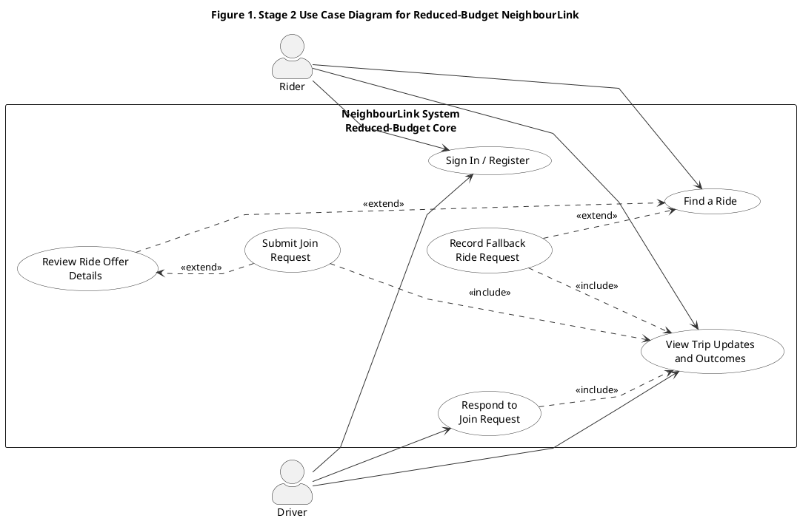
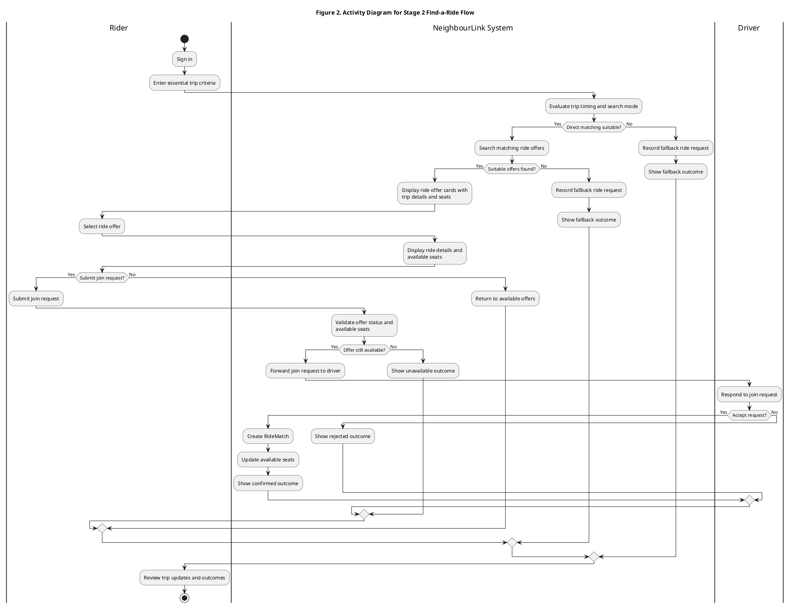
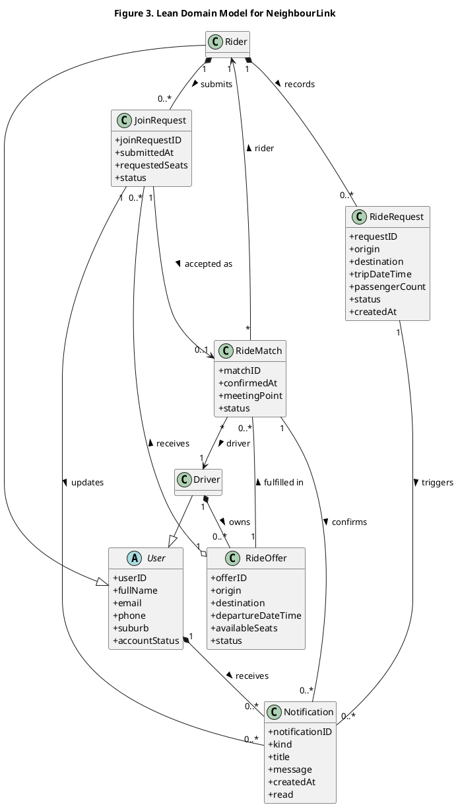

# Revised Appendix A / B / C PlantUML for the Current Static-Site

This appendix matches the final reduced-budget `Static-Site` prototype.

The current prototype keeps one clear confirmed-match path:

- rider finds existing ride offers
- rider reviews ride-offer details
- rider submits a join request
- driver accepts or rejects the join request
- the system shows visible trip outcomes

The fallback request path is still present, but only as a reduced rider-visible record when direct matching is unsuitable.

---

## Appendix A. Reduced-Budget Use Case Diagram and PlantUML Source

---

## Appendix B. Reduced-Budget Activity Diagram and PlantUML Source

---

## Appendix C. Lean Domain Model and PlantUML Source

