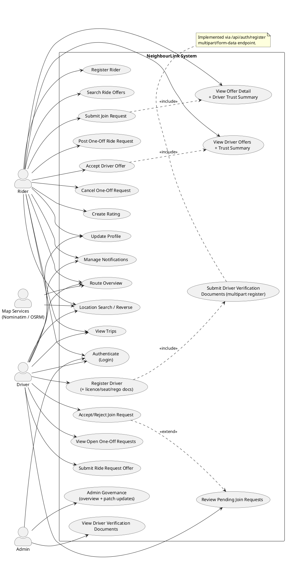
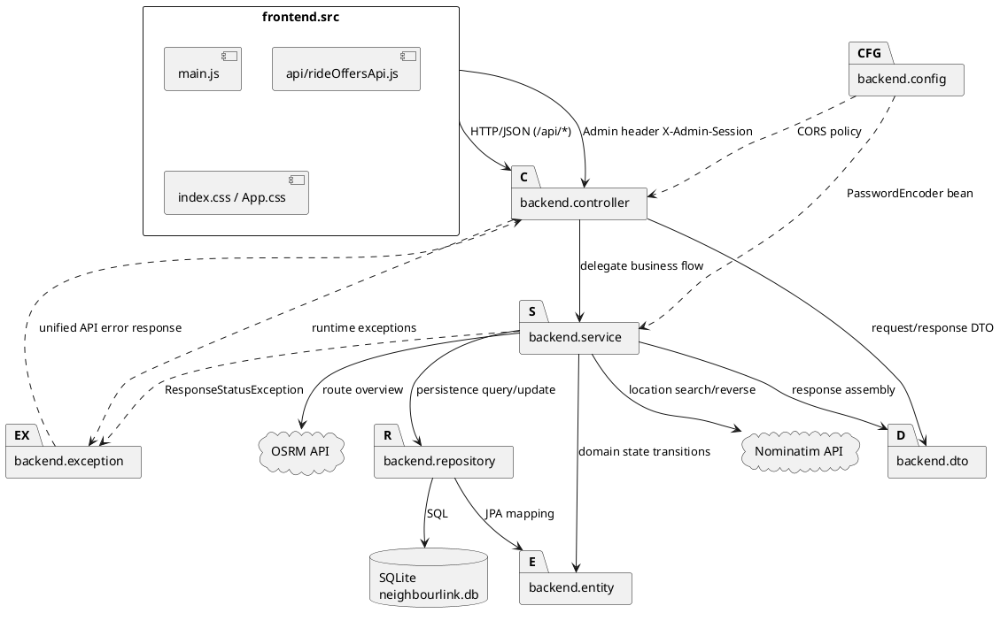
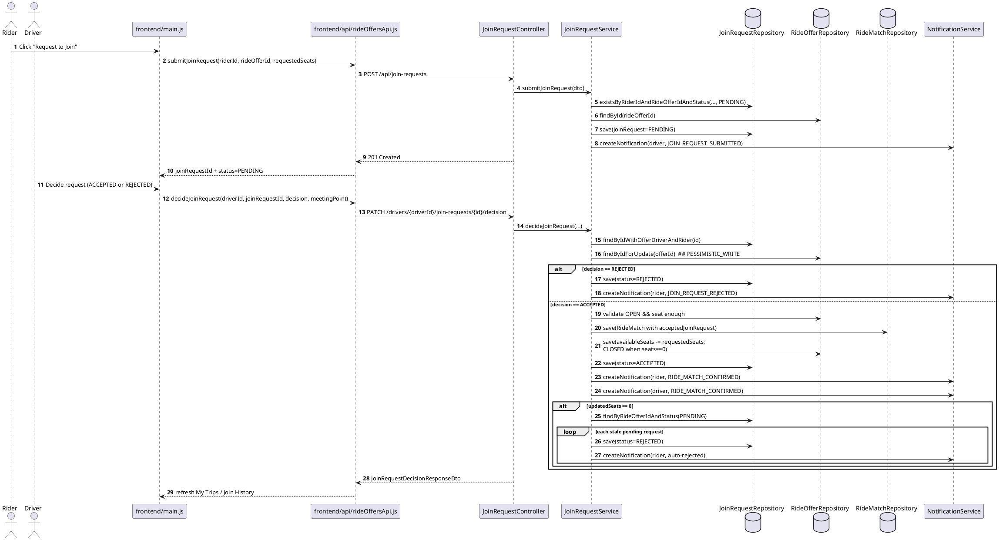
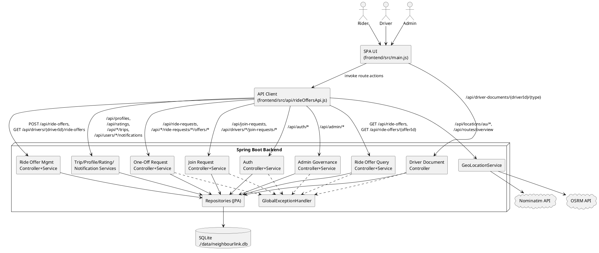
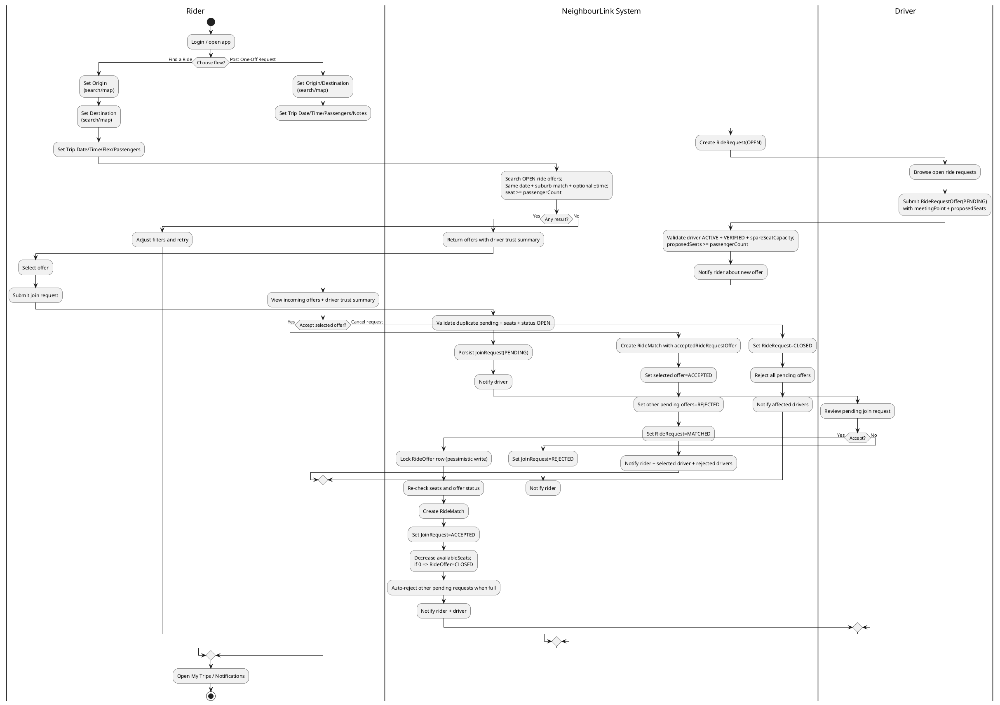
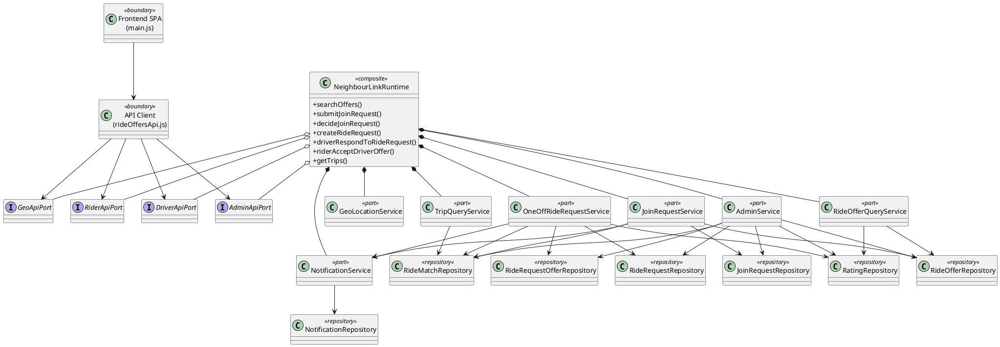
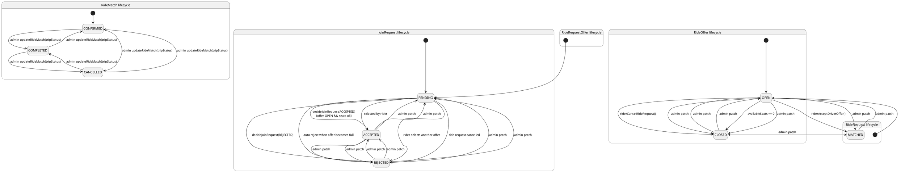

# NeighbourLink 完整 UML 套件（基于实际代码，可核查）

> 基线代码版本：`77c164f`  
> 生成日期：`2026-04-22`  
> 说明：以下 UML 不是“理论版”，而是按当前仓库真实代码（Controller/Service/Repository/Entity/Frontend API）反推。  
> 范围包含当前代码中的扩展功能（如 Admin、地图/路线、文档上传与审核入口）。

---

## 1) 用例图（Use Case Diagram）

### 代码证据（可核查）
- `backend/src/main/java/com/neighbourlink/controller/AuthController.java:28,33,39,55`
- `backend/src/main/java/com/neighbourlink/controller/RideOfferQueryController.java:25,37`
- `backend/src/main/java/com/neighbourlink/controller/JoinRequestController.java:31,37,42,47`
- `backend/src/main/java/com/neighbourlink/controller/OneOffRideRequestController.java:34,40,63,72,81`
- `backend/src/main/java/com/neighbourlink/controller/TripController.java:21,26`
- `backend/src/main/java/com/neighbourlink/controller/ProfileController.java:22,27`
- `backend/src/main/java/com/neighbourlink/controller/RatingController.java:22`
- `backend/src/main/java/com/neighbourlink/controller/NotificationController.java:24,32,37`
- `backend/src/main/java/com/neighbourlink/controller/AdminController.java:39,46,53,62,69,78,85,110,117,126,133,142,149`
- `backend/src/main/java/com/neighbourlink/controller/LocationController.java:21,29`
- `backend/src/main/java/com/neighbourlink/controller/RouteController.java:20`
- `backend/src/main/java/com/neighbourlink/controller/DriverDocumentController.java:36`



---

## 2) 包图（Package Diagram）

### 代码证据（可核查）
- 包结构：`backend/src/main/java/com/neighbourlink/{controller,service,repository,entity,dto,config,exception}`
- 前端结构：`frontend/src/main.js`、`frontend/src/api/rideOffersApi.js`
- 外部依赖：`backend/src/main/java/com/neighbourlink/service/GeoLocationService.java:30,32,34`



---

## 3) 类图（Class Diagram）

### 代码证据（可核查）
- 继承与核心实体：`entity/User.java`, `entity/Rider.java`, `entity/Driver.java`
- 匹配链路：`entity/RideOffer.java`, `entity/JoinRequest.java`, `entity/RideRequest.java`, `entity/RideRequestOffer.java`, `entity/RideMatch.java`
- 信任链路：`entity/Profile.java`, `entity/Rating.java`
- 鉴权与通知：`entity/Credential.java`, `entity/Notification.java`
- 关键约束：
  - `RideOffer.@Version`：`entity/RideOffer.java:83`
  - `JoinRequest` 唯一约束：`entity/JoinRequest.java:18-24`
  - `RideMatch` XOR + 唯一约束：`entity/RideMatch.java:20-33`
  - `Rating.rater_user_id`：`entity/Rating.java:27`

```plantuml
@startuml
skinparam classAttributeIconSize 0
skinparam shadowing false
hide empty methods

abstract class User {
  +id: Long
  +fullName: String
  +email: String
  +phone: String
  +suburb: String
  +accountStatus: AccountStatus
}

class Rider {
  +preferredTravelTimes: String
  +usualDestinations: String
}

class Driver {
  +licenceVerifiedStatus: VerificationStatus
  +vehicleInfo: String
  +spareSeatCapacity: Integer
  +licenceDocumentPath: String
  +spareSeatProofDocumentPath: String
  +vehicleRegoDocumentPath: String
  +verificationNotes: String
}

class Credential {
  +id: Long
  +passwordPlain: String
}

class Profile {
  +id: Long
  +bio: String
  +travelPreferences: String
  +trustNotes: String
  +averageRating: Double
}

class RideOffer {
  +id: Long
  +origin: String
  +originSuburb: String
  +destination: String
  +destinationSuburb: String
  +departureDate: LocalDate
  +departureTime: String
  +availableSeats: Integer
  +version: Long
  +status: RideOfferStatus
}

class JoinRequest {
  +id: Long
  +requestDateTime: LocalDateTime
  +requestedSeats: Integer
  +status: JoinRequestStatus
}

class RideRequest {
  +id: Long
  +origin: String
  +originSuburb: String
  +destination: String
  +destinationSuburb: String
  +tripDate: LocalDate
  +tripTime: String
  +passengerCount: Integer
  +notes: String
  +status: RideRequestStatus
}

class RideRequestOffer {
  +id: Long
  +proposedSeats: Integer
  +meetingPoint: String
  +status: RideRequestOfferStatus
  +createdAt: LocalDateTime
}

class RideMatch {
  +id: Long
  +confirmedDateTime: LocalDateTime
  +meetingPoint: String
  +tripStatus: TripStatus
}

class Rating {
  +id: Long
  +score: Integer
  +comment: String
  +createdDate: LocalDateTime
}

class Notification {
  +id: Long
  +type: String
  +title: String
  +message: String
  +relatedRideMatchId: Long
  +read: Boolean
  +createdAt: LocalDateTime
}

class AuLocationReference {
  +id: Long
  +state: String
  +suburb: String
  +postcode: String
  +address: String
  +latitude: Double
  +longitude: Double
}

enum AccountStatus { ACTIVE; INACTIVE; SUSPENDED }
enum VerificationStatus { PENDING; VERIFIED; REJECTED }
enum RideOfferStatus { OPEN; CLOSED }
enum JoinRequestStatus { PENDING; ACCEPTED; REJECTED }
enum RideRequestStatus { OPEN; CLOSED; MATCHED }
enum RideRequestOfferStatus { PENDING; ACCEPTED; REJECTED }
enum TripStatus { CONFIRMED; COMPLETED; CANCELLED }

Rider --|> User
Driver --|> User

User "1" *-- "0..1" Profile : owns >
User "1" -- "0..1" Credential : authenticates >
User "1" -- "0..*" Notification : receives >
User "1" -- "0..*" Rating : gives >

Driver "1" -- "0..*" RideOffer : posts >
Rider "1" -- "0..*" JoinRequest : submits >
RideOffer "1" -- "0..*" JoinRequest : receives >

Rider "1" -- "0..*" RideRequest : posts >
RideRequest "1" -- "0..*" RideRequestOffer : receives >
Driver "1" -- "0..*" RideRequestOffer : sends >

RideMatch "*" -- "1" Driver : driver >
RideMatch "*" -- "1" Rider : rider >
RideOffer "1" -- "0..*" RideMatch : fromOffer >
RideRequest "1" -- "0..1" RideMatch : fromRequest >
JoinRequest "1" -- "0..1" RideMatch : acceptedJoinRequest >
RideRequestOffer "1" -- "0..1" RideMatch : acceptedRideRequestOffer >

Profile "1" -- "0..*" Rating : receives >

note right of JoinRequest
DB unique constraint:
(rider_id, ride_offer_id, status)
Prevents duplicate pending join for same rider+offer
end note

note right of RideOffer
Optimistic lock via @Version(version)
plus pessimistic lock query in repository
for decision path
end note

note bottom of RideMatch
DB XOR check constraint:
Either acceptedJoinRequest + rideOffer is set
OR acceptedRideRequestOffer + rideRequest is set.
Never both.
Unique constraints also enforce:
- ride_request_id appears at most once
- accepted_join_request_id appears at most once
- accepted_ride_request_offer_id appears at most once
end note

note right of Rating
rater_user_id is mandatory.
Trust model stores "who rated whom".
end note
@enduml
```

---

## 4) 序列图（Sequence Diagram）

### 场景：Join Request 决策（含并发锁与自动清退）

### 代码证据（可核查）
- 控制器入口：`controller/JoinRequestController.java:31,47`
- 核心流程：`service/JoinRequestService.java:51,155`
- 并发控制：`repository/RideOfferRepository.java:43,45` + `service/JoinRequestService.java:166`
- 防重复 pending：`service/JoinRequestService.java:59`
- 自动清退：`service/JoinRequestService.java:227`



---

## 5) 组件图（Component Diagram）

### 代码证据（可核查）
- 前端入口与路由：`frontend/src/main.js:3776-3788`
- API 客户端：`frontend/src/api/rideOffersApi.js`
- 文档查看入口（前端 admin 表格直链）：`frontend/src/main.js:3291-3293`
- 后端边界组件：所有 `controller/*.java`
- 服务组件：所有 `service/*.java`
- 数据源：`backend/src/main/resources/application.yml`（SQLite）
- 地图外部组件：`service/GeoLocationService.java:30,32,34`



---

## 6) 活动图（Activity Diagram）

### 场景：Rider 两条主流程（Find a Ride / Post One-Off）+ Driver 决策

### 代码证据（可核查）
- 查询与匹配规则：`service/RideOfferQueryService.java:32,191,204,215`
- Join 请求与决策：`service/JoinRequestService.java:51,155`
- One-off 请求与接受：`service/OneOffRideRequestService.java:68,236,284`
- Driver 能力约束：`service/OneOffRideRequestService.java:483`



---

## 7) 组合结构图（Composite Structure Diagram）

### 代码证据（可核查）
- 聚合入口能力来自：`RideOfferQueryService`, `JoinRequestService`, `OneOffRideRequestService`, `TripQueryService`
- 通知协作：`service/NotificationService.java`
- 端口对应前端调用：`frontend/src/api/rideOffersApi.js`



---

## 8) 剖面图（Profile Diagram）

> 这里用“项目实现剖面”方式展示：把当前 Spring/JPA 语义作为 stereotypes 应用到具体类上。

### 代码证据（可核查）
- `controller/*.java`（`@RestController`）
- `service/*.java`（`@Service` + `@Transactional`）
- `repository/*.java`（`JpaRepository` + `@Query`）
- `entity/*.java`（`@Entity`）
- `entity/RideOffer.java:83`（`@Version`）
- `entity/RideMatch.java:28-33`（`@Check XOR`）
- `repository/RideOfferRepository.java:43-45`（`@Lock(PESSIMISTIC_WRITE)`）

```plantuml
@startuml
skinparam classAttributeIconSize 0
skinparam shadowing false

package "NeighbourLink Implementation Profile" <<profile>> {
  class RestController <<stereotype>>
  class Service <<stereotype>>
  class Repository <<stereotype>>
  class Entity <<stereotype>>
  class TransactionalOperation <<stereotype>>
  class VersionedEntity <<stereotype>>
  class XorConstrainedEntity <<stereotype>>
  class PessimisticLockRepository <<stereotype>>
}

class JoinRequestController <<RestController>>
class OneOffRideRequestController <<RestController>>
class AdminController <<RestController>>

class JoinRequestService <<Service>>
class OneOffRideRequestService <<Service>>
class AdminService <<Service>>

class RideOfferRepository <<Repository>>
class RideMatchRepository <<Repository>>

class RideOffer <<Entity>>
class RideMatch <<Entity>>
class JoinRequest <<Entity>>

RestController <|.. JoinRequestController
RestController <|.. OneOffRideRequestController
RestController <|.. AdminController

Service <|.. JoinRequestService
Service <|.. OneOffRideRequestService
Service <|.. AdminService

Repository <|.. RideOfferRepository
Repository <|.. RideMatchRepository

Entity <|.. RideOffer
Entity <|.. RideMatch
Entity <|.. JoinRequest

VersionedEntity <|.. RideOffer
XorConstrainedEntity <|.. RideMatch
PessimisticLockRepository <|.. RideOfferRepository

TransactionalOperation .. JoinRequestService : submitJoinRequest(), decideJoinRequest()
TransactionalOperation .. OneOffRideRequestService : createRideRequest(),\ndriverRespondToRideRequest(),\nriderAcceptDriverOffer(), riderCancelRideRequest()
TransactionalOperation .. AdminService : update*() methods

note right of RideOffer
@Version field: version
Optimistic concurrency token
end note

note right of RideOfferRepository
findByIdForUpdate() with
@Lock(PESSIMISTIC_WRITE)
end note

note right of RideMatch
@Check XOR:
acceptedJoinRequest vs acceptedRideRequestOffer
end note
@enduml
```



---

## 9) 状态机图（State Machine Diagram）

### 代码证据（可核查）
- `entity/JoinRequestStatus.java`
- `entity/RideOfferStatus.java`
- `entity/RideRequestStatus.java`
- `entity/RideRequestOfferStatus.java`
- `entity/TripStatus.java`
- 转换入口：
  - `service/JoinRequestService.java:155`
  - `service/OneOffRideRequestService.java:236,284,359`
  - `service/AdminService.java`（可改状态）



---

## 10) 通信图（Communication Diagram）

### 场景：Rider 在 UC3 中查看 Driver Offers（含 trust）并接受一个 Offer

### 代码证据（可核查）
- 查看 offer + trust：`service/OneOffRideRequestService.java:126,155,498`
- 接受 offer：`service/OneOffRideRequestService.java:284`
- 唯一匹配检查：`service/OneOffRideRequestService.java:310`
- 拒绝其余 pending：`service/OneOffRideRequestService.java:326`
- 前端调用：`frontend/src/api/rideOffersApi.js:193`、`frontend/src/main.js:2000`

```plantuml
@startuml
skinparam shadowing false

object Rider
object "main.js UI" as UI
object "rideOffersApi.js" as Api
object "OneOffRideRequestController" as Ctrl
object "OneOffRideRequestService" as Svc
object "RideRequestRepository" as RR
object "RideRequestOfferRepository" as RRO
object "RatingRepository" as RAT
object "RideMatchRepository" as RM
object "NotificationService" as NS

Rider -> UI : 1. Open offers list for request
UI -> Api : 2. getRideRequestOffersForRider(riderId, rideRequestId)
Api -> Ctrl : 3. GET /riders/{riderId}/ride-requests/{rideRequestId}/offers
Ctrl -> Svc : 4. listOffersForRiderRequest(...)
Svc -> RRO : 5. findByRideRequestIdWithDriver(...)
Svc -> RAT : 6. count/avg ratings per driver profile
Svc --> Ctrl : 7. offers + DriverTrustSummary[]
Ctrl --> Api : 8. response payload
Api --> UI : 9. render trust-aware offers

Rider -> UI : 10. Accept selected offer
UI -> Api : 11. acceptRideRequestOffer(riderId, rideRequestId, offerId)
Api -> Ctrl : 12. PATCH .../offers/{offerId}/accept
Ctrl -> Svc : 13. riderAcceptDriverOffer(...)
Svc -> RR : 14. findByIdWithRider(rideRequestId)
Svc -> RRO : 15. findByIdWithRequestAndDriver(offerId)
Svc -> RM : 16. existsByRideRequestId(rideRequestId)?
Svc -> RM : 17. save(new RideMatch)
Svc -> RRO : 18. save(selectedOffer=ACCEPTED)
Svc -> RRO : 19. findByRideRequestIdAndStatus(PENDING)
Svc -> RRO : 20. save(otherOffers=REJECTED)
Svc -> RR : 21. save(rideRequest=MATCHED)
Svc -> NS : 22. notify rider + selected driver + rejected drivers
Svc --> Ctrl : 23. RideRequestOfferAcceptResponseDto
Ctrl --> Api : 24. 200 OK
Api --> UI : 25. update My Trips + status
@enduml
```



---

## 附：快速核对清单（防“图和代码不一致”）

1. 并发控制是否体现在图中：`RideOfferRepository.findByIdForUpdate` + `RideOffer.@Version`。  
2. RideMatch 二选一来源是否体现在图中：`RideMatch @Check XOR`。  
3. Rating 是否包含评分人：`Rating.rater_user_id`。  
4. UC3 接受前 trust 是否体现在图中：`buildDriverTrustSummary()` 出现在 offer-list 流程。  
5. JoinRequest 重复 pending 与满座清退是否体现在图中：`existsByRiderIdAndRideOfferIdAndStatus` + stale pending auto-reject。
